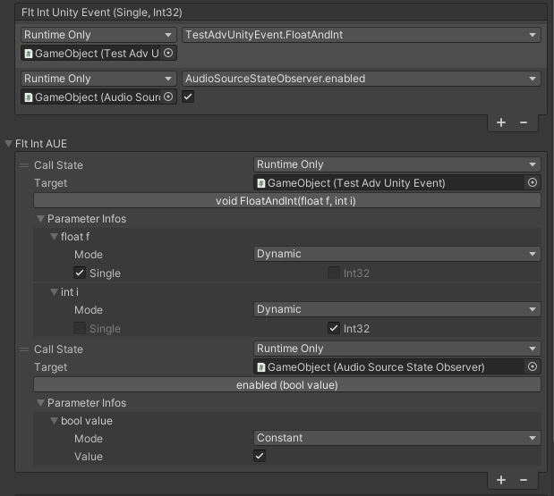

# Upgrader

This document aims to explain how to use the Upgrader, to update from `UnityEvent` to `AUEEvent` without destroying your whole project.

## What's for?

If you want to replace an `UnityEvent` by an `AUEEvent` in a class, all your bound data from the `UnityEvent` will be lost if you just change the type.

By using the Upgrader, you can transfer the data from the `UnityEvent` to the `AUEEvent`, then get rid of the `UnityEvent`.



## How to

There is 3 big steps:

- Transfer data from `UnityEvent` to `AUEEvent`

  - Make your class inheriting from `ISerializationCallbackReceiver`

    ```csharp
    public class MyClass : MonoBehavior, ISerializationCallbackReceiver
    {
        [SerializedField]
        private UnityEvent _myEvent;
        
        [SerializedField]
        private AUEEvent _myEventAUE;
    }
    ```

  - In `OnBeforeSerialize`, and add the line `AUE.Upgrader.ToAUEEvent(this, _unityEvent, _aueEvent);`

    ```csharp
    public void OnBeforeSerialize()
    {
        AUE.Upgrader.ToAUEEvent(this, _myEvent, _myEventAUE);
    }
    ```

    

  - Run `Tools > AdvUnityEvent > Upgrade`.

  - Ensure few scenes/prefabs have their data correctly transferred.

- Update and cleanup

  - Remove `ISerializationCallbackReceiver` relative stuff, it is now useless.

  - Remove `[SerializedField]` or change your public to private variable you are replacing. The idea is that it is not serialized anymore.

    ```csharp
    public class MyClass : MonoBehavior
    {
        private UnityEvent _myEvent; // Will not be serialized anymore
        
        [SerializedField]
        private AUEEvent _myEventAUE;
    }
    ```

    

  - Run `Tools > AdvUnityEvent > Upgrade`.

  - Open a scene/prefab in a text editor and observes that the field has disappeared from the serialization.

- Rename

  - Add attribute `[FormerlySerializedAs("_oldVariableName")]` on your `AUEEvent` and rename your variable as you want. When your event will be deserialized, it will keep the old field data, but future serialization will use the new name.

    ```csharp
    [SerializeField, FormerlySerializedAs("_myEventAUE")]
    private AUEEvent _myEvent = null;
    ```

  - Run `Tools > AdvUnityEvent > Upgrade`.

- Cleanup

  - You can now remove the `[FormerlySerializedAs]` attribute

    ```csharp
    [SerializeField]
    private AUEEvent _myEvent = null;
    ```

    

*Note: since `Tools > AdvUnityEvent > Upgrade` is a really long operation, we recommend to do this on multiple fields/classes at the same time, instead of doing it one by one.*