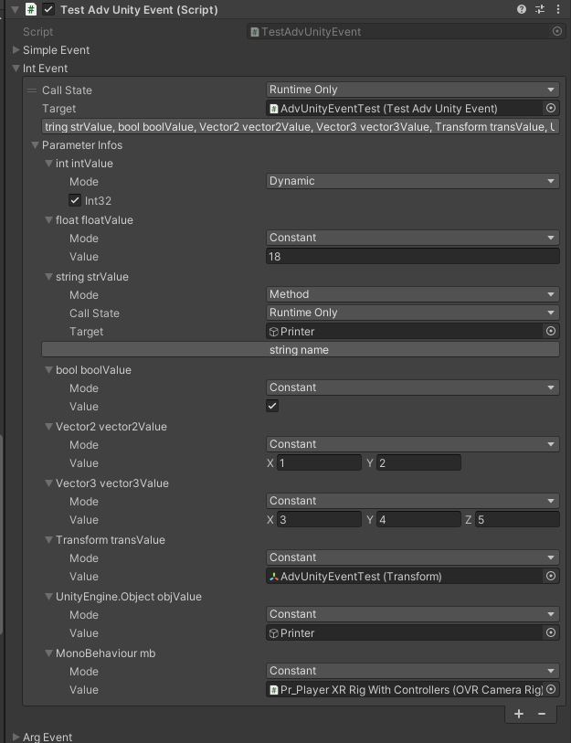
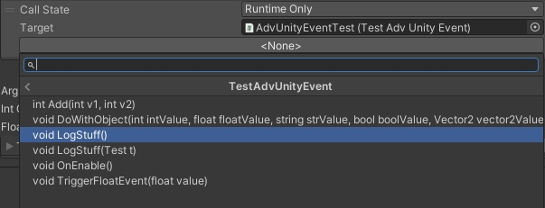

# Advanced Unity Event

Lightweight but more powerful version of Unity Event.

- Reorderable events
- Can directly use generic `AUEEvent<T>` instead of a creating a new class inheriting from `UnityEvent`
- Method searcher popup (`AddComponent`-like)
- Can use `AUEGet<TResult>` to create a method's result
- Custom parameters:
  - Constant: support all basics native constants + UnityEngine.Object + custom serializable class
  - Dynamic: allow to select where you pass your method arguments
  - Method: use nested method as parameter

[Changelog](Documentation~/Changelog.md)

## Screenshots






## Usage

```csharp
// Create simple event, without arguments
[SerializeField]
private AUEEvent _simpleEvent;

// Create an event that pass an int argument
[SerializeField]
private AUEEvent<int> _intEvent;

 // Supports 4 arguments. Can add more easily.
[SerializeField]
private AUEEvent<int, float, string, Transform> _argEvent;

 // Create a specialized event from inheriting
[Serializable]
public class FloatAdvUnityEvent : AUEEvent<float> { }

[SerializeField]
private FloatAdvUnityEvent _floatEvent;

 // Create a method that will return a float
[SerializeField]
private AUEGet<float> _floatGetter;

// Create a method that will return a string, and allow to pass an int argument.
[SerializeField]
private AUEGet<int, string> _intGetter; 
```

